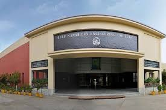
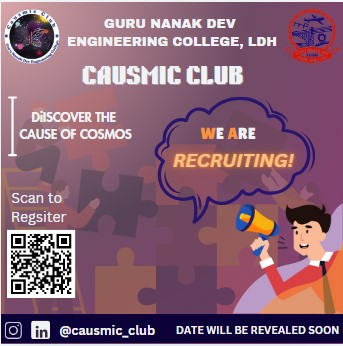

# Prabhjot Kaur
Greetings everyone. My name is Prabhjot Kaur. I am pursuing Bachelor of Technology (Btech) in Computer Science (CSE) at Guru Nanak Dev Engineering College. I am interested in exploring and creating new things and learn high coding skills using which i can create something new and helpful. I am also intersted in reading novel books and doing some curriculam activities also. I am really excited of my engineering plus coding journey and hope i will give my hundred percent in my field and came out to be one of the best Coder and Engineer. I hope after four years of my journey i will make my institute proud of me.

## Senior Secondary Examination details:-

| Subject Name | Marks Obtained |
| -------- | ------- |
| English  | 93 |
| Punjabi | 98 |
| Physics    | 93 |
| Chemistry | 91 |
| Mathematics | 97 |
| Total Percentage | 94.4% |

# Guru Nanak Dev Engineering College:-

## Activity Report of Student Induction Program 2024

### Day 1 - 10-07-2024

The beginning of my college journey starts with listening and reciting kirtan at the Gurdwara Sahib of the College campus. It was a positive and great experience to receive the blessings before stating the new jouney. After that we were made to sit in the auditorium and listening to the experience and journey of the great alumni of our college. They light up
the students with their powerful thoughts and experiences. We listen very motivational and inspirational speeches from them and it gave me a great push to work hard in my college journey. Overall, it was a wonderful day and i am excited to see what the future holds.  

### Day 2- 11-07-2024

**On the second day of induction program the guests are :-**

| Sr no. | Guest Name |
| -------- | ------- |
| 1.  | Dr. Arvind Dhingra |
| 2. | Dr. Parminder Singh |
| 3.    | Dr. H.S. Rai |

Today we get the information about the scope and purpose of the socities and clubs of the college campus. They tells us about the **SCIE**, **TSTE**, **E2S2 events**, **SAE**, **ISHRAI**, **ASME**, **ACM**, **PFA**, **CSI**, **Data Science Club**, **Parwaaz Club**, **Live wire Club**, **Causmic Club**, **English Club**, **Itian Club** and many more and tells us about their aims and benefits. Dr. Arvind Dhingra tells us about the type of memberships:-
- Member
- Active Member
- Executive Member
- Office Bearer

We also got to know about the examination system of the college and cgpa system. We learn the system of attempting and preparing for examination. On this day we also got the detailed description about the scholarship schemes. We were made to know about the success of our college alumni and their work being done at the National and Intenation level.
The Key Points I grasp from today's speakers are:
- Life is about changing and growing
- 3Ps for Success:-
1. Passion
2. Persistence
3. Patience

### Day 3- 12-07-2024

On the third day of induction program we are having classes. The first class is of Canva and in this class Our Seniors from Causmic Club gives us information about the Canva, using which we can create wonderful presentations, logos, templates, cards, banners etc. They explain and help us to understand the Canva Step by Step and gives us task to create the banner for Caumic Club and the banner i made by the learning is :-  

The second class is of Mathematics in which we revise Differentiation formulas and solve sums of Differentiation. Overall the seconds day is full of learing and useful day.

### Day 4- 15-04-2024

**The Speakers of the fourth Day of Induction Program are :-***

| Sr no. | Guest Name |
| -------- | ------- |
| 1.  | Dr. Randhir Singh |
| 2. | Dr. Pyare Lal Garg |
| 3.    | Mr. Sony Goyal |
| 4. | Mr. Pancham |

## JOSH- JOURNEY ON SUCCESS HIGHWAY

### What is Life?
- The word **L** in **LIFE** stands for - **Learn**
- The Seconds word **I** stands for- **Inquire**
- The third word **F** stands for- **Future**
- The fourth word **E** stands for- **Explore**

## ALways Remember
- Give your 100%
- Should have Efficiency and Compatibility

## Communication Skills

Topics:-

- Willingness to hear things in the communication that are not being said.
- Body Language
- Posture while talking with someone
- Difference between Fake smile and real smile.
- Facial expressions

  
  
