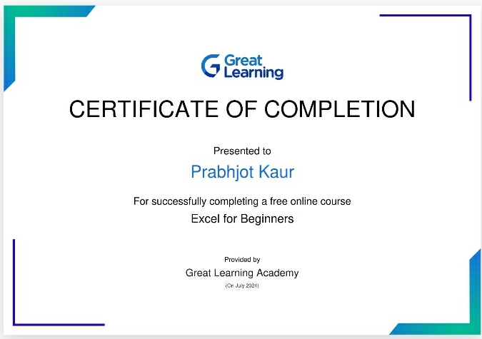

# Prabhjot Kaur
Greetings everyone. My name is Prabhjot Kaur. I am pursuing Bachelor of Technology (Btech) in Computer Science (CSE) at Guru Nanak Dev Engineering College, Ludhiana. I am interested in exploring and creating new things and learn high coding skills using which i can create something new and helpful. I am also intersted in reading novel books. I am really excited of my engineering plus coding journey at Gndec and hope i will give my hundred percent in my field and came out to be one of the best Coder and Engineer. I hope after four years of my journey i will make my institute having proud on me.

## Senior Secondary Examination details:-

| Subject Name | Marks Obtained |
| -------- | ------- |
| English  | 93 |
| Punjabi | 98 |
| Physics    | 93 |
| Chemistry | 91 |
| Mathematics | 97 |
| Total Percentage | 94.4% |

## Blogs

[View my Blog](studentrepo.md)

## My Excel certificate 

  
  
