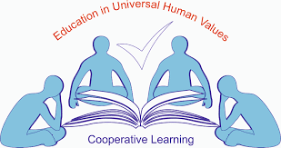

# Prabhjot Kaur
Greetings everyone. My name is Prabhjot Kaur. I am pursuing Bachelor of Technology (Btech) in Computer Science (CSE) at Guru Nanak Dev Engineering College. I am interested in exploring and creating new things and learn high coding skills using which i can create something new and helpful. I am also intersted in reading novel books and doing some curriculam activities also. I am really excited of my engineering plus coding journey and hope i will give my hundred percent in my field and came out to be one of the best Coder and Engineer. I hope after four years of my journey i will make my institute proud of me.

## Senior Secondary Examination details:-

| Subject Name | Marks Obtained |
| -------- | ------- |
| English  | 93 |
| Punjabi | 98 |
| Physics    | 93 |
| Chemistry | 91 |
| Mathematics | 97 |
| Total Percentage | 94.4% |

# Guru Nanak Dev Engineering College:-

## Vision
Realization of Glimpses of a Golden India in the real(rural) India which lives and abounds in its villages. GNDEC will excel nationally and distinguish itself as a recognized pre-eminent leader to serve this 70% Brotherhood through its socioeconomic upliftment by exposure of the havenots to Engg. & Technology thereby grooming them as technically competent and intellectually-vital Graduates through practically focused quality learning experiences, and thus assuring productive Careers for them.

## Mission
- Upliftment of Rural Students through technical education.
- Respond to local societal needs by developing selected 'targeted research projects'.
- Quality training programs in need based modern technology.
- To maintain state-of-the-art infrastructure in laboratories.
- To promote culture of self-employment.
- To impart non-formal education to unemployed youth.
- To inculcate moral, ethical, spiritual values in education at all levels.

## Activity Report of Student Induction Program 2024

### Day 1 - 10-07-2024

The beginning of my college journey starts with listening and reciting kirtan at the Gurdwara Sahib of the College campus. It was a positive and great experience to receive the blessings before stating the new jouney. After that we wre made to sit in the auditorium and then we listen to the speeches given by the guests of day 1. The guests of Day 1 of induction program were:-

| Sr. No. | Guest Name |
| -------- | ------- |
| 1. | Pr. Dr. Sehijpal Singh |
| 2. | NSET Dir. S. Inderpal Singh |
| 3. | Er. Jiwandeep Singh |
| 4. | SSP Rajeshwar Singh |

Pr. Dr. Sehijpal singh welcomed us to the GNDEC campus and intoduce us about the campus facilities and benefits. The director of Nankana Sahib Education Trust highlighted that Guru Nanak Dev Engineering College was established to honor Nanakana Sahib, the birthplace of Guru Nanak Dev ji. itwas founded with the goal of addressing economic backwarddness through technology. The foundation stone of the college was laid in 1956. The vision of college is to admit 70% rural students to benefit them with the advancement of technology. Er. Jiwandeep Singh who is serving as a PCS officer advice us to never wait for the oppprotunity to come to you, grap the opportunity. We should learn to grab the opportunity whenever we get chance. Never let it go. SSP Rajeshwar Singh encouraged us to always walk onto the path of good deeds and helping others. Every good deed  and every bad deed we do always count. He encouraged us to embrace four essential phrases: 
1. I am Sorry
2. Please forgive me
3. Thank yo
4. I love you
Afer every mistake and lie we should be sorry to the god immediately. We can lie to everyone but we cannot lie to ourselves and God. We ourselves knows the truth behind our lie. As Newton's third law of states that every action has an equal and opposite reaction, similarly what we give to th world and nature, we always receive the same thing in return. So be 

### Day 2- 11-07-2024

**On the second day of induction program the guests are :-**

| Sr no. | Guest Name |
| -------- | ------- |
| 1.  | Dr. Arvind Dhingra |
| 2. | Dr. Parminder Singh |
| 3.    | Dr. H.S. Rai |

Today we get the information about the scope and purpose of the socities and clubs of the college campus. They tells us about the **SCIE**, **TSTE**, **E2S2 events**, **SAE**, **ISHRAI**, **ASME**, **ACM**, **PFA**, **CSI**, **Data Science Club**, **Parwaaz Club**, **Live wire Club**, **Causmic Club**, **English Club**, **Itian Club** and many more and tells us about their aims and benefits. Dr. Arvind Dhingra tells us about the type of memberships:-
- Member
- Active Member
- Executive Member
- Office Bearer

We also got to know about the examination system of the college and cgpa system. We learn the system of attempting and preparing for examination. On this day we also got the detailed description about the scholarship schemes. We were made to know about the success of our college alumni and their work being done at the National and Intenation level.
The Key Points I grasp from today's speakers are:
- Life is about changing and growing
- 3Ps for Success:-
1. Passion
2. Persistence
3. Patience

### Day 3- 12-07-2024

On the third day of induction program we are having classes. The first class is of Canva and in this class Our Seniors from Causmic Club gives us information about the Canva, using which we can create wonderful presentations, logos, templates, cards, banners etc. They explain and help us to understand the Canva Step by Step and gives us task to create the banner for Caumic Club and the banner i made by the learning is :-  

The second class is of Mathematics in which we revise Differentiation formulas and solve sums of Differentiation. Overall the seconds day is full of learing and useful day.

### Day 4- 15-04-2024

**The Speakers of the fourth Day of Induction Program are :-***

| Sr no. | Guest Name |
| -------- | ------- |
| 1.  | Dr. Randhir Singh |
| 2. | Dr. Pyare Lal Garg |
| 3.    | Mr. Sony Goyal |
| 4. | Mr. Pancham |

## JOSH- JOURNEY ON SUCCESS HIGHWAY

### What is Life?
- The word **L** in **LIFE** stands for - **Learn**
- The Seconds word **I** stands for- **Inquire**
- The third word **F** stands for- **Future**
- The fourth word **E** stands for- **Explore**

## ALways Remember
- Give your 100%
- Should have Efficiency and Compatibility

## Communication Skills

Topics:-

- Willingness to hear things in the communication that are not being said.
- Body Language
- Posture while talking with someone
- Difference between Fake smile and real smile.
- Facial expressions

### Day 5- 16-07-2024

### English Activities

On the Day 5 of induction program we were having english activities and quiz compeititions. Engaging in English activities during induction was a fantastic way to break the ice and connect with fellow students. Participating in english activities not only boosted my confidence but also fostered a sense of camaraderie among the classmates. English activities during induction were instrumental in preparing us for academic writing and critical thinking throughout the college journey.Through English activities, we learned to express our ideas clearly and succinctly, which proved invaluable in every aspect of our academic pursuits. There are so many questions in quiz compeitition related to sports, National and international achievements and recognising the great personalities
Overall, the English activities during college induction not only enriched our language skills but also fostered a welcoming atmosphere where learning and personal development thrived.

### Day 6-  17-07-2024

Today we are having classes:

#### Class 1-

The First class is of Mathematics in which we revise all integration formulas and solve the sums using those formulas.

#### Class 2-

The second class is of UHV- 
## **UHV- UNIVERSAL HUMAN VALUES** 

  
  
