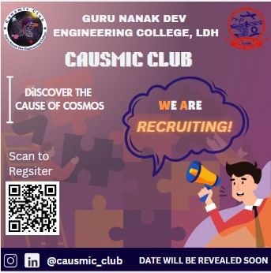

# Guru Nanak Dev Engineering College:-

## Vision
Realization of Glimpses of a Golden India in the real(rural) India which lives and abounds in its villages. GNDEC will excel nationally and distinguish itself as a recognized pre-eminent leader to serve this 70% Brotherhood through its socioeconomic upliftment by exposure of the havenots to Engg. & Technology thereby grooming them as technically competent and intellectually-vital Graduates through practically focused quality learning experiences, and thus assuring productive Careers for them.

## Mission
- Upliftment of Rural Students through technical education.
- Respond to local societal needs by developing selected 'targeted research projects'.
- Quality training programs in need based modern technology.
- To maintain state-of-the-art infrastructure in laboratories.
- To promote culture of self-employment.
- To impart non-formal education to unemployed youth.
- To inculcate moral, ethical, spiritual values in education at all levels.

### Day 1 - 10-07-2024

The beginning of my college journey starts with listening and reciting kirtan at the Gurdwara Sahib of the College campus. It was a positive and great experience to receive the blessings before stating the new jouney. After that we were made to sit in the auditorium and then we listen to the speeches given by the guests of day 1. The guests of Day 1 induction program were:-

| Sr. No. | Guest Name |
| -------- | ------- |
| 1. | Pr. Dr. Sehijpal Singh |
| 2. | NSET Dir. S. Inderpal Singh |
| 3. | Er. Jiwandeep Singh |
| 4. | SSP Rajeshwar Singh |

Pr. Dr. Sehijpal singh welcomed us to the GNDEC campus and intoduce us about the campus facilities and benefits. The director of Nankana Sahib Education Trust highlighted that Guru Nanak Dev Engineering College was established to honor Nanakana Sahib, the birthplace of Guru Nanak Dev ji. It was founded with the goal of addressing economic backwardness through technology. The foundation stone of the college was laid in 1956. The vision of college is to admit 70% rural students to benefit them with the advancement of technology. Er. Jiwandeep Singh who is serving as a PCS officer advice us to never wait for the oppprotunity to come to you, grap the opportunity. We should learn to grab the opportunity whenever we get chance. Never let it go. SSP Rajeshwar Singh encouraged us to always walk onto the path of good deeds and helping others. Every good deed  and every bad deed we do always count. He encouraged us to embrace four essential phrases: 
1. I am Sorry
2. Please forgive me
3. Thank you
4. I love you

Afer every mistake and lie we should be sorry to the god immediately. We can lie to everyone but we cannot lie to ourselves and God. We ourselves knows the truth behind our lie. As Newton's third law of motion states that every action has an equal and opposite reaction, similarly what we give to the world and nature, we always receive the same thing in return. 

### Day 2- 11-07-2024

**On the second day of induction program the guests were :-**

| Sr no. | Guest Name |
| -------- | ------- |
| 1.  | Dr. Arvind Dhingra |
| 2. | Dr. Parminder Singh |
| 3.    | Dr. H.S. Rai |

Today we get the information about the scope and purpose of the socities and clubs of the college campus. They tells us about the **SCIE**, **TSTE**, **E2S2 events**, **SAE**, **ISHRAI**, **ASME**, **ACM**, **PFA**, **CSI**, **Data Science Club**, **Parwaaz Club**, **Live wire Club**, **Causmic Club**, **English Club**, **Itian Club** and many more and tells us about their aims and benefits. Dr. Arvind Dhingra tells us about the type of memberships:-
- Member
- Active Member
- Executive Member
- Office Bearer

We also got to know about the examination system of the college and cgpa system. We learn the system of attempting and preparing for examination. On this day we also got the detailed description about the scholarship schemes of the college. We were made to know about the success of our college alumni and their work being done by them at the National and Intenation level.
The Key Points I grasp from today's speakers are:
- Life is about changing and growing
- 3Ps for Success:-
1. Passion
2. Persistence
3. Patience

### Day 3- 12-07-2024

On the third day of induction program we are having classes. The first class is of Canva and in this class Our Seniors from Causmic Club gives us information about the Canva, using which we can create wonderful presentations, logos, templates, cards, banners etc. They explain and help us to understand the Canva Step by Step and gives us task to create the banner for Caumic Club and the banner i made by the learning is :-  

The second class is of Mathematics in which we revise Differentiation formulas and solve sums of Differentiation. Overall the second day is full of learing and useful day.

### Day 4- 15-04-2024

**The Speakers of the fourth Day of Induction Program were :-**

| Sr no. | Guest Name |
| -------- | ------- |
| 1.  | Dr. Randhir Singh |
| 2. | Dr. Pyare Lal Garg |
| 3.    | Mr. Sony Goyal |
| 4. | Mr. Pancham |

## JOSH- JOURNEY ON SUCCESS HIGHWAY

### What is Life?
- The word **L** in **LIFE** stands for - **Learn**
- The Seconds word **I** stands for- **Inquire**
- The third word **F** stands for- **Future**
- The fourth word **E** stands for- **Explore**

## ALways Remember
- Give your 100%
- Do what you love, love what you do
- Should have Efficiency and Compatibility

## Communication Skills

**Topics:-**

- Willingness to hear things in the communication that are not being said.
- Body Language
- Posture while talking with someone
- Difference between Fake smile and real smile.
- Facial expressions

### Day 5- 16-07-2024

### English Activities

On the Day 5 of induction program we were having english activities and quiz compeititions. Engaging in English activities during induction was a fantastic way to break the ice and connect with fellow students. Participating in english activities not only boosted my confidence but also fostered a sense of camaraderie among the classmates. English activities during induction were instrumental in preparing us for academic writing and critical thinking throughout the college journey.Through English activities, we learned to express our ideas clearly and succinctly, which proved invaluable in every aspect of our academic pursuits. There are so many questions in quiz compeitition related to sports, National and international achievements and recognising the great personalities.  
Overall, the English activities during college induction not only enriched our language skills but also fostered a welcoming atmosphere where learning and personal development thrived.

### Day 6-  17-07-2024

Today we were having classes:

#### Class 1-

The First class is of Mathematics in which we revise all integration formulas and solve the sums using those formulas.

#### Class 2-

The second class is of UHV (Universal Human Values)- 
## **UHV- UNIVERSAL HUMAN VALUES** 

### Need for Value Education
All human beings aspire for a happy, fulfilling life. For a human being, there are two important questions pertaining to this:-
- What is my aspiration?
- How to fullfill your aspiration?

The purpose of education is to facilitate the development of clarity on the aspiration and adequate competence to actualize it.
For this it is essential to understand what a happy, fulfilling and successful life is- what is really valuable for human being: What is purpose of human being? It is also necessary to learn the skills to actualise our aspiration. This is the skill domain.
Value and skills go hand in hand. Both value and skills are required. There is an essentiaal complementary between the two. But more importantly, the prime need of value education is to understand human aspirations, to discover what is truly valuable in life; and work out on the program for its fulfillment.  
*Leading to harmony*: It ultimately needs to promote harmony within the individual, among human beings and with the entier nature.

## Understanding the harmony in family
- appreciating
- accepting
- understanding
- Practicing to live in a relationship
 
### Understanding to live in a relationship

 - Relationship is buttering oneself(I) and otherself (I2)
 - Felings in relationships
 - Feelings can be recognised
 - Fulfillment of feelings

#### Type of Feelings
- Trust
- Respect
- Affection
- Care
- Glory
- Gratitude
- Respect

### Day 7- 18-07-2024

On the Day 7 of induction program the first class of UHF inwhich learn about the following things.
## Understanding the Human Being

So what is Human being? The proposal of human being is the coexistence of the Self and the Body. Self is what we term as "I" and Body is what we see with our eyes.

### The needs of the Self and Body

The need of Self is happiness (e.g. feeeling of respect leading to happiness) while the nedd of body is physical facility (e.g. food). All the need related to the Self are continuous in time while all the needs related to the Body are required for a limited time. This is one way we can differentiate between the need of the Self and the need of the Body.
The other way to see the difference between the difference between the two is in erms of quantity and quality. The need for food is quantitavie in nature. We can identify the quality of the food needed to nurture our body.

### The Activities of the Self and Body

The Self has the activity of desire, thought and expectations which are continuous. On the other hand, any activity of the Body, like eating, walking, etc. is temporary in time.

### The response of the Self and Body

The response of the Body is based on recognising and fulfilling  whereas the response of the Self is based on knowing, assuming, recognising and fullfilling. The recognition and fulfillment of the Body is definite, while that of Self is determined by the activity of assuming. As assumption changes, the recognition and fulfillment by the Self also changes.
All the problems of a human being are due to assumptions wuithoiut  knowing, and the solution lies in ensuring the activity of kowing. And this is possible only through education-sanskar.

### Understanding harmony in Self

The activities of the self can be seen in terms of desire, thought and expectations. These powers are inexhaustible, and the activities are continuous. The activiities of imaging, analyzing-comparing and selecting-tasting are always going on, whether we aware of them or not.
If your imagination is guided by your natural acceptance, you are sure to be in harmony and happiness within. You are Self-orgarnised.

#### Ensuring harmony in the Self by way of Self-exploration
 To achieve the harmony in the Self, we need to self-exploration. In the process, we need to:
 - Know our natural acceptance
 - Be aware of our imagination
 - Find out the source of imagination
 - Work out a way to sort out outr imagination till it is fully in line with our natural acceptance
When the imagination is in harmony with the natural acceptance, there is harmony in the Self. This harmony is happiness.

| DATE | RESOURCE PERSON | TOPIC |
| -------- | -------- | ------- |
| 18-07-2024 | DR. Harwinder Singh | NCC |

Dr. Harwinder singh is the ANO OF NCC. He introduces us of the esteem benefits of opting NCC. He listed down the physical as well mental benefits of NCC. He explained us that how NCC not only gives us the army training but also helps us in shaping our personality, buliding confidence and communicating skills, enhancing leadershipn qualities and team work and the most important thing, learning disciplain. 

Benefits of opting NCC includes:-
- SAHARA Scholarship for NCC cadets
- Expenses of uniforms and camps are beared by the government
- Chance to get selected in armed forces
- NDA
- Besides being position in armed forces, NCC also provides us life skills that serves us whole life.
- The life skills provided by NCC are:-
  

| DATE | RESOURCE PERSON | TOPIC |
| -------- | -------- | ------- |
| 18-07-2024 | Er. Jasvir Singh Grewal | NSS |

Dr. Jasvir Singh Grewal is the coordinator of NSS. He introduces us about the purpose of NSS society and the work being done by the NSS society of the college campus. NSS provides the opprotunity to serve the society and to save the environment by planting trees and cleaning waste. Planting tree help in improving the Air Quality Index (ATQ) of the environment.

#### Work Done by NSS:-
- Afforestation
- AIDS awareness
- Blood donation camps
- cleaniness of our environment
- Disaster Manangement etc.
  
#### Benefits of NSS:-
- Personality Development.
- Preference in Admission / Employment.
- National Integration camp, Adventure Programme, State level as well as National Level programme.
- It helps in acquiring leadership qualities and democratic attitude.
- It provides diversified opportunities to students in colleges and universities to develop their personality through community service.
- It developer a sense of involvement in the task of nation building.
- Volunteer"s interaction with the slum dwellers and villagers expose them to the realities of life and bring about a change in their social perception.
- It helps in developing positive attitude, self-confidence, courage & patience.
- It helps in developing his / her skill to perform certain jobs, quality of an organiser, an administrator and development of personality as a whole.
- He / she gets opportunities to see the community closely and thus gets an experience of human nature in relation to his / her environment.
- Gets the opportunity to meet the people from different walks of life.
- He/she gets the opportunity to participate in various National / State level programme such as National Integration, Motivational Lamps, value oriented self-development camps, Adventure camps, workshops. Youth exhibition, cultural programmes etc.

### Day 8- 19-07-2024

| RESOURCE PERSON |
| -------- |
| DR. Harwinder Singh |

#### Transition- Campus to Corporate
Er. Kanwardeep Grewal mam intorduces us about ***The Journey from Campus to Corporate*** and  ***Building a Future Beyond the Classroom***. In addition with technical skills, Soft skills are also improtant. Without soft skills our technical skills are Zero. We also saw a role play by our seniors related to interviews that teaches us about how to behave during interviews and how to balance our confidence in front of interviewer.  
**What are soft skills?**
- Basic etiquatee
- Personality traits

### Essential Softskills for Students:-

### Its all about C

### First Impression 
#### ABC of first impression:-
- Appearance
- Behaviour
- Communication

#### Key points
- It takes 7 seconds to form first impression.
- Don't use fillers in communication.
- Most important thing- NETWORKING
- Grrom yourself

| RESOURCE PERSON |
| -------- |
| Dr. Jawinder Singh |

Dr. Jaswinder singh is the incharge of IAPT. He is a great presonality. He is awarded with shiksha ratan. He said that everything in this world is connected with mathematics. He also give suitable example. He intoduces the concept of induction and conduction also. Where in classes these topics seems very tough and boring, he explains them in very easy and fun way. He also gave us trick to remember how many bones are in human body and which part of the body have how many bones.  

## Department visit:-

### Department of Computer Science and Engineering

#### Department Vision
To generate competent professionals to become part of the industry and research organizations at the national and international levels.

#### Department Mission
a. Providing a strong theoretical and practical background across the computer science discipline with an emphasis on software development.  
b. Imparting the skills necessary to continue education to grow professional.  
c. Empowering the youth in rural communities with computer education.  
d. Inculcating professional behavior, strong ethical values, innovative research capabilities and leadership abilities.

### Two Societies/clubs under Computer Science Department:-

1. CSI- Computer society of India
2. Data Science Club

Along with that,our professors also gave us details about the placements and training cells of campus. The highest package goes upto 51 lakhs. Then we get information about the examination system of computer science department. After the enlightening session, we had the opportunity to visit the computer lab.

### Day 9- 22-07-2024

| RESOURCE PERSON |
| -------- |
| Dr. SB Singh |
| Dr. Pushpinder Singh |

First of all, Dr. S.B. singh performs an activitymin which we all were ask to write down our name, Branch, Section, Father's Name, Mother's Name, Phone number, Parent's Phone number,address, Desires, achievemnets, srengths, weaknesses, motive etc. on a page and after that those pages were collected from us by Ncc cadets on duty. After this activity, Dr. S.B. singh gave us life lessons. He motivated us to remain consistent and dedicated towards our dreams. Key points i could able to grasp from his insights are: 
1. Every small step towards your dream is a leap of faith in yourself.
2. Fuel your ambition with determination, there's no limit to what you can achieve.
3. Stay focused, and surround yourself with positivity.

Dr. Pushpinder Singh explained type of learners to us:
## Type of learners:-
1. Visual
2. Auditory
3. Kinesthetic
He advised us to do SMART work instead of HARD work. Full form of SMART is:
- S: Specific
- M: Measurement
- A: Achievement
- R: Realistic
- T: Time
He instructed us to always compete with ownself. He told us to learn from nature the qualities of self management and flexibility like honey bees in Bamboo trees. He told us to always be grounded at the times of problem like bamboo trees bent during thundrstorms while the other trees who stand straight fall down and broke.

After that we were given some information about the Causmic Club of our college:

### CAUSMIC CLUB
#### Vision
To learn something from everything in its physical essence; the essence, which is equally enlightening and dark.

#### Mission
The club members, believe in rational and reason-based thinking and reasoning and wish to promote a culture of critical thinking. We strive to provide a platform for students from all departments for sharing conscience about universe so that a community of innovators is cherished.

### Day - 10  23-07-2024
On the Day 10 of induction program we were having classes.
The first class is of Mathematics in which we learn partial fraction method of integration and Mehods of finding the solution of differential equation of first order & first degree.
The seconds class is of Chemistry in which we revise basics of organic chemistry, Inorganic chemistry and Physical chemistry.

### Day - 11 24-07-2024
| RESOURCE PERSON |
| -------- |
| Mr. Guaravdeep Singh |

Mr. Gauravdeep Singh is National award holder and a very affectionate personality. He is the owner of "IOC". He told us about his whole life and success journey. He belong to a very middle class background but he never let that thing stuck in his way of success. He told us that how he identify his actual talent after getting fail in his 12th. He identify that he is good in speaking and he uses his talent in his life journey and become successful.

| RESOURCE PERSON |
| -------- |
| Er. Lakhveer Singh |

Er. Lakhveer Singh is the Coordinator of CML 

### **CML- CENTER FOR MULTI-FACETED LEARNING**

CML provides the students with e-learning (NPTEL-SWAYAM), Personality Development and Enterpreneurship Capsule Courses. It also provides courses for students aspiring to join armed forces. Apart from regular professional learning, CML brings the students an opportunity to prepare for various entrance exmas like GATE, P.S.U, Civil Service examination like U.P.S.C along with Employment Enhancement Programs.

### MISSION & VISION

Centre for Multi-Faceted Learning aims at promoting thye holistic development of students. The focus of this center is to hone the communication skills, interpersonal skills, problem solving skills and further develop the overall personality of students. Guiding student towards building a successful career by identifying their fields of interest and providing them sufficient training for compeititive examinations is one of the targeted tasks to be held under this facility.

